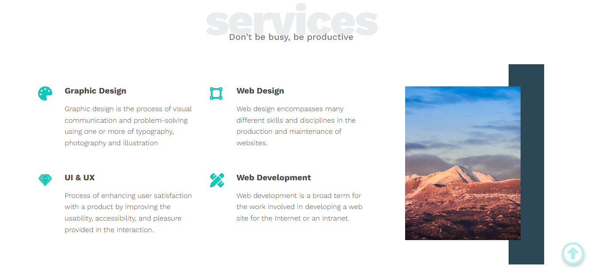

# 🎨 Leon HTML & CSS Template

A modern, responsive HTML & CSS template for sleek website designs.

## 📌 Features

✔️ Fully responsive design  
✔️ Clean and modern UI  
✔️ Optimized for performance

## 🛠️ Technologies Used

- **HTML5**
- **CSS3 (Flexbox & Grid)**

## 🔗 Live Demo

[🚀 View the Live Demo](https://mohamed-hellmy.github.io/leon-html-css-template/)

## 📸 Screenshot



## ✨ Author

👤 **Mohamed Hellmy**  
🔗 [GitHub Profile](https://github.com/Mohamed-hellmy)  
📧 [Email Me](mailto:mohamedhellmy1010@gmail.com)

## 📥 Installation

Clone the repository and open `index.html` in your browser:

```sh
git clone https://github.com/Mohamed-hellmy/kasper-html-css-template.git
cd kasper-html-css-template
open index.html
```

